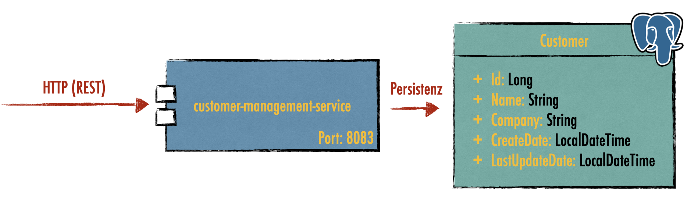

# Customer Management Service

## Technische Voraussetzungen

* Java 17
* Maven 3.x
* GIT
* Docker + Docker Compose

```shell 
$ java --version
openjdk 17.0.3 2022-04-19
OpenJDK Runtime Environment GraalVM CE 22.1.0 (build 17.0.3+7-jvmci-22.1-b06)
OpenJDK 64-Bit Server VM GraalVM CE 22.1.0 (build 17.0.3+7-jvmci-22.1-b06, mixed mode, sharing)

$ mvn --version
Maven home: /usr/local/Cellar/maven/3.8.5/libexec
Java version: 17.0.3, vendor: GraalVM Community, runtime: /Library/Java/JavaVirtualMachines/graalvm-ce-java17-22.1.0/Contents/Home
Default locale: de_DE, platform encoding: UTF-8
OS name: "mac os x", version: "12.3.1", arch: "x86_64", family: "mac"

$ git --version
git version 2.32.0 (Apple Git-132)

$ docker version
Client:
 Cloud integration: 1.0.22
 Version:           20.10.12
 ...
```

## Bauen und Testen

### Starten und Bauen der Anwendung

```sh 
# build it
$ git clone https://github.com/FA-Team-SZUT/workshop-neusta-2022-05-18_und_19
$ mvn clean package -P build-docker-images

# build it with integration tests
$ mvn clean verify -P build-docker-images

# start local postgresql
$ docker compose -f assets/docker/docker-compose.yml up

# run it with spring boot
$ mvn spring-boot:run

# run it with plain java
$ java -jar target/customer*.jar
```

### Demo Requests

```sh 
# HTTP request examples
# Post a new customer
$ curl -i -H "Content-Type: application/json" --request POST --data '{"name":"Lars", "company":"szut"}}' http://localhost:8083/api/

# Read a specific customer     
$ curl -i -H "Accept: application/json" --request GET http://localhost:8083/api/{customer-id}   
```

## Kapitel 1: Wiederholung Unit Tests

__Aufgaben__: 
1. Implementiere im Package service/validator im Bereich der Tests eine Klasse `CustomerNameValidatorTest` und schreibe Unit-Tests für [CustomerNameValidator](src/main/java/de/szut/customer/service/validator/CustomerNameValidator.java) , die sicherstellen, dass:
   
    a) ein Kundenname vergeben worden ist (kein null-Wert!)

    b) der Kundenname nicht aus Leerstrings bzw Leerzeichen besteht

    c) der vergebene Name die maximal erlaubte Länge einhält (Tipp: Verwende dafür Strings.repeat())
 
    d) die Länge des vergebenen Name nicht kleiner 3 ist

    e) der vergebene Name mindestens aus drei Zeichen und maximal aus 100 Zeichen besteht

    f) der vergebene Name auch aus Umlauten (ä, ö etc.) bestehen darf 

    
Nach dem zweiten Test ist der Code für die Instanziierung eines neuen CustomerNameValidator-Objekts dupliziert. Da wir für jeden Unit-Test eine Instanz benötigen, bietet es sich an diesen Code auszulagern. Führe ein entsprechendes Refactoring deiner Tests anhand des unten abgebildeten Code-Schnipsels aus der letzten Übung durch. Beachte: Die Annotation `@BeforeEach` bewirkt, dass die Methode `setUp()` vor jedem Test ausgeführt wird, jeder Test also eine neue Instanz erhält.

```sh 
public class MaexchenTest {
    private Maexchen game;

    @BeforeEach
    public void setUp(){
        game = new Maexchen();
    }

    @Test
    public void givenTwoAndOne_WhenCalculatePoints_Then1000(){
        assertEquals(1000, game.calculatePoints(2, 1));
    }
    ...
}
```

2. Implementiere im Package service/validator im Bereich der Tests eine Klasse `CompanyNameValidatorTest` und schreibe Unit-Tests für [CompanyNameValidator](src/main/java/de/szut/customer/service/validator/CompanyNameValidator.java). Die Tests sollen alle Anforderungen aus dem Kommentar über der Klassendefinition abdecken. Nutze parametrisierte Tests wo sinnvoll.

## Kapitel 2: Mocking

* Für weitere Infos zu Mockito siehe [Mockito](https://site.mockito.org/)
* Beispielcode siehe Test für [CreateCustomerService](src/main/java/de/szut/customer/service/CreateCustomerService.java)  in [CreateCustomerServiceTest](src/test/java/de/szut/customer/service/CreateCustomerServiceTest.java)

__Aufgaben__: 
1. Implementierere im Bereich der Tests im Package `database` die Klasse `CustomerRepositoryTest`, um für [CustomerRepository](src/main/java/de/szut/customer/database/CustomerRepository.java) Tests zu implementieren.
2. `CustomerRepository`enthält eine Abhängigkeit zu `CustomerJpaRepository`, die gemockt werden muss. Erstelle einen entsprechenden Mock.
3. Schreibe einen Test, der die Methode `exists()` für den posiven Fall testet, dass ein Kunde in der Datenbank vorhanden ist,
4. Schreibe einen Test, der die Methode `exists()` für den negativen Fall testet, dass ein Kunde in der Datenbank nicht vorhanden ist,
5. Schreibe zwei Tests, die die Methode `findBy()` für den negativen und positiven Fall testen.

__Aufgaben__: 
1. Implementierere im Bereich der Tests im Package `rest` die Klasse `CustomerControllerMocks`, um für [CustomerController](src/main/java/de/szut/customer/rest/CustomerController.java) Tests zu implementieren.
2. Mocke die Abhängigkeiten, die der Controller enthält.
3. Schreibe einen Test, der einen Kunden erfolgreich anlegt und prüft ob, Id, Name und Firma richtig gespeichert worden sind.
4. Schreibe einen Test, der die Methode `getCustomer()` testet und dabei auch den richtigen Statuscode überprüft.
5. Schreibe einen Test, der die Methode `getCustomer()` auf den negativen Fall hin testet.

## Kapitel 3: Slice Tests

* Was ist an den Tests aus Kapitel 2 nicht so gut? 
  * siehe auch [Youtube](https://www.youtube.com/watch?v=_CGvdhRc9DE&t) bzw [Github](https://github.com/larmic/unit-testing-best-bad-practices)
* [Spring Boot Slice Tests](https://developer.okta.com/blog/2021/07/12/spring-boot-test-slices)
* [Testcontainers](https://www.testcontainers.org/)

__Aufgaben__: 
1. Mach dir die Funktionsweise der Klasse [CustomerController](src/main/java/de/szut/customer/rest/CustomerController.java) klar.
2. Schaue dir die bereits geschriebenen Slice-Tests für den Controller in [CustomerControllerTest](src/test/java/de/szut/customer/rest/CustomerControllerTest.java) an. Lasse sie laufen.
3. Der Test für den Get-Endpunkt, der einen existierenden Customer liefert fehlt. Implementiere diesen Test. Konfiguriere deinen Mock so, dass er ein von dir instanziiertes Customer-Objekt liefert und prüfe, ob der Endpunkt den Statuscode 200, die richtige Id, den richtigen Namen und die richtige Firma liefert. Führe deinen Test aus.

__Aufgaben__:
1. Starte deinen Docker-Daemon.
2. Mach dir die Funktionsweise der Klasse [CustomerRepository](src/main/java/de/szut/customer/database/CustomerRepository.java) mit ihren Abhängigkeiten klar.
3. Schaue dir die bereits geschriebenen Slice-Tests für das Repository in [CustomerRepositoryTest](src/test/java/de/szut/customer/database/CustomerRepositoryTest.java) an. Lasse sie laufen.
4. Die Tests für die Methode `Optional<CustomerEntity> findBy(final long id)` fehlen noch. Implementiere einen Test, der einen in der Datenbank existierenden Kunden anhand seiner Id ausliest. Dazu muss zunächst ein Customer-Objekt in der Datenbank gespeichert werden. Lies dieses danach wieder aus und überprüfe, ob das Optional ein Objekt kapselt und ob alle Attribute des Objektes korrekt sind. Für die Überprüfung der Datumsangabe kannst du dich am folgenden Code-Snippet orientieren:
```sh 
assertThat(optionalCustomerEntity.get().getCreateDate()).isCloseTo(LocalDateTime.now(), within(1, ChronoUnit.SECONDS));
```
5. Implementiere einen Test, der das Verhalten der Methode bei einer nicht existierenden Id prüft. 

## Kapitel 4: Integration Tests

__Aufgabe2__: 
1. Öffne den Integrationstest [HappyPathIT](src/test/java/de/szut/customer/HappyPathIT.java). Mach dir die Funktionsweise des Tests klar. Führe ihn aus.
2. Der Integrationstest zum Testen des Get-Endpunktes fehlt. Schreibe diesen Test. Beachte dabei: a) einen Customer-Entity über das JpaRepository in der Datenbank zu speichern, b) den Get-Endpunkt aufzurufen und c) den Statuscode sowie die Attribute zu verifizieren. 